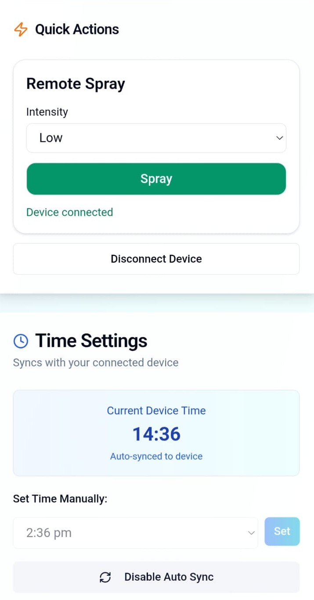
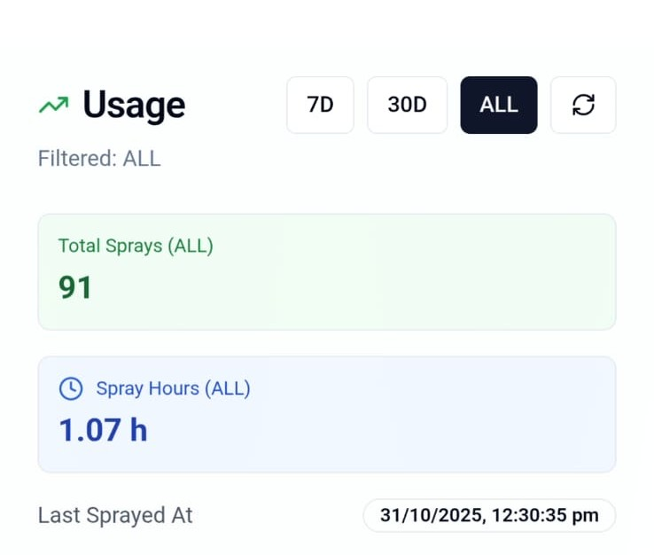

# VeraShield – Smart Dispenser Companion App

VeraShield is a mobile app for configuring and controlling the VeraShield smart spray dispenser over Bluetooth Low Energy (BLE).

You can discover nearby devices, trigger sprays, set schedules, monitor battery and user statistics

<strong>🔧 See what this app controls <strong>: 👉 [VeraShield firmware](https://github.com/Kushal-Chandar/VeraShield-Firmware)

## 🔗 Live demo and media

- 👉 [Live demo](https://kushal-chandar.github.io/VeraShield-App/#/demo)
- **Video walkthrough:**

https://github.com/user-attachments/assets/c4ddcf43-1d32-47ae-b97d-a368c9ff5348

## 📸 Screenshots

  
  
  

- **Quick Actions and Time Sync**
- **Device control and scheduling**
- **Statistics**

## 🧩 What this app does

The app is the companion client for the VeraShield BLE dispenser:

- **Device discovery & time sync**
  - Scan for nearby VeraShield devices over BLE
  - Connect and keep device time in sync

- **Control & automation**
  - Trigger sprays manually from the app
  - Create and edit schedules for automatic sprays
  - Use intensity presets tuned for different environments

- **Monitoring**
  - Check current battery level
  - View user statistics and usage trends
  - Review recent spray history

- **Alerts**
  - Get notified when the device sprays
  - See updates when schedules change
  - Warnings for high settings to avoid environmental damage

## 🛠 Tech stack

This project is built as a modern cross-platform app:

- **Core**
  - React + TypeScript
  - Vite for fast dev builds
  - Tailwind CSS for styling

- **Mobile / Native**
  - Capacitor for native builds
  - Capacitor BLE plugin for Bluetooth Low Energy communication

- **Target platforms**
  - Android 6.0+
  - iOS 11+
